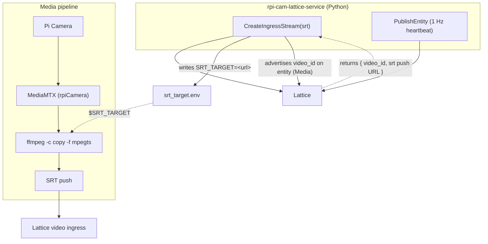

# rpi-cam-lattice-service

A Raspberry Pi camera **Lattice integration** built on the Anduril Lattice SDK
for **gRPC (Connect)** in Python, packaged to run as a `systemd` service
alongside a **MediaMTX SRT push** server on the same Pi.

The app demonstrates two `systemd` services that cooperate:

1. **`rpi-cam-lattice-service`** (this Python daemon) — publishes the camera to
   Lattice as a stationary **asset entity** with an EO camera sensor and health,
   and registers an **SRT video ingress** with Lattice's VideoManager. The video
   id Lattice returns is advertised on the entity's `Media` component so
   operators can find the live feed.
2. **MediaMTX** (SRT push) — captures the Pi Camera (`source: rpiCamera`) and
   pushes the H.264 stream over **SRT (caller mode)** to the ingress URL Lattice
   returned. This mirrors the sibling `rtsp-server` / `mpeg-ts-server` projects,
   but the egress transport is SRT.

## How the pieces fit together



The Python service owns the Lattice video lifecycle. It passes MediaMTX the SRT
destination through the `srt_target.env` `EnvironmentFile`, which the MediaMTX
systemd unit loads so the `runOnReady` ffmpeg command can read it as
`$SRT_TARGET`.

## Repository layout

```
src/rpi_cam_lattice_service/
  main.py            entry point: config, client, register SRT ingress, run
  config.py          .env + env-var config (auth, TLS, camera location, video)
  auth.py            static token OR OAuth2 client-credentials (static preferred)
  lattice_client.py  EntityManager + VideoManager Connect clients (TLS + auth)
  service.py         lifecycle: 1 Hz publish loop, signals, graceful shutdown
  worker.py          State -> Entity mapping (camera + drone builders)
  sources/
    base.py          source interface + plain-Python State
    camera.py        stationary Raspberry Pi camera source (default)
    drone_sim.py     the UAV flight simulator (retained for tests)
mediamtx.yml         MediaMTX SRT push config (rpiCamera -> ffmpeg -> SRT)
deploy/systemd/
  rpi-cam-lattice-service.service   the Python daemon
  mediamtx-srt.service              the MediaMTX SRT push server
scripts/
  install-mediamtx.sh  download pinned MediaMTX (v1.16.1) arm64 on the Pi
  push-mac-cam.sh      Mac SRT test-push (off-Pi testing)
  verify.py            read the published entity back from Lattice
tests/                 attitude math, drone sim, camera + entity mapping
```

## SDK packages

Two Buf Schema Registry packages (Anduril's index, **not** PyPI): the protobuf
messages (`anduril-lattice-sdk-bufbuild-py`) and the Connect stubs
(`anduril-lattice-sdk-connectrpc-py`). They use Anduril's pure-Python `protobuf`
runtime and the `connectrpc`/`pyqwest` runtime. Notable: enums use short member
names (`Template.ASSET`, `SensorType.CAMERA`, `MediaType.VIDEO`); some numeric
fields are `DoubleValue` wrappers; oneofs are set with `protobuf.Oneof(field, value)`.

## Setup

```bash
python3 -m venv .venv
source .venv/bin/activate
pip install -r requirements.txt   # carries the --extra-index-url
pip install -e ".[dev]"           # editable install + pytest
cp .env.example .env              # then fill in real values
./scripts/install-mediamtx.sh     # ON THE PI: fetch the MediaMTX arm64 binary
```

## Configuration

Config is read from `.env` (path via `--config`); real environment variables
take precedence (so systemd `Environment=`/`EnvironmentFile=` works).

**Auth & TLS** (same as `lattice-neuron-grpc`):

| Variable | Meaning |
|---|---|
| `LATTICE_ENDPOINT` | Environment hostname, no scheme. |
| `ENVIRONMENT_TOKEN` | Static bearer token (preferred when set). |
| `CLIENT_ID` / `CLIENT_SECRET` | OAuth2 client credentials (used when no static token). |
| `SANDBOXES_TOKEN` | Sandbox authorization token; additive. |
| `LATTICE_CA_CERT_PATH` | Anduril-issued PEM CA for offline/air-gapped TLS (recommended edge method; verification stays on). |

**Camera & video:**

| Variable | Meaning |
|---|---|
| `ENTITY_ID` / `ENTITY_NAME` | Stable id/display name for the camera entity. |
| `PLATFORM_TYPE` | Ontology platform type (default `Camera`). |
| `CAMERA_LATITUDE` / `CAMERA_LONGITUDE` / `CAMERA_ALTITUDE_HAE_METERS` | The camera's fixed location — **set these**. |
| `VIDEO_ENABLED` | Register an SRT ingress with Lattice and advertise the video id (default `true`). |
| `VIDEO_TITLE` | Ingress stream title (defaults to the entity name). |
| `SRT_PASSPHRASE` | Optional SRT ingress passphrase. |
| `SRT_TARGET_FILE` | Where to write `SRT_TARGET=<url>` for the MediaMTX unit (default `./srt_target.env`). |

## Run

On the Pi, run both services (see systemd below), or manually for testing:

```bash
# 1) Lattice service: publishes the entity + registers the SRT ingress,
#    writing srt_target.env for MediaMTX.
rpi-cam-lattice-service --config .env   # or: python -m rpi_cam_lattice_service

# 2) MediaMTX: reads srt_target.env and pushes the camera over SRT.
set -a; . ./srt_target.env; set +a
./mediamtx mediamtx.yml
```

Off-Pi, you can exercise the SRT path from a Mac with `scripts/push-mac-cam.sh`
(set `SRT_TARGET` to the URL the service logged).

## Verify (live round-trip)

Live verification is deferred (no reachable environment during development). On a
network where `LATTICE_ENDPOINT` is reachable:

```bash
rpi-cam-lattice-service --config .env          # terminal 1
python scripts/verify.py --config .env --entity-id rpi-cam-01   # terminal 2
```

Expect `is_live: True`. Confirm the entity carries a `Media` item (the video id)
and that MediaMTX's SRT push reaches the Lattice ingress.

## Test

```bash
pytest   # attitude math, drone sim, camera source + entity mapping (video id, sensor)
```

## Deploy (systemd on the Pi)

```bash
sudo cp deploy/systemd/rpi-cam-lattice-service.service /etc/systemd/system/
sudo cp deploy/systemd/mediamtx-srt.service /etc/systemd/system/
sudo systemctl daemon-reload
sudo systemctl enable --now rpi-cam-lattice-service   # writes srt_target.env
sudo systemctl enable --now mediamtx-srt              # loads it, pushes SRT
journalctl -u rpi-cam-lattice-service -u mediamtx-srt -f
```

Edit the `WorkingDirectory`/`ExecStart`/`EnvironmentFile` paths in both units for
your install location. The Pi Camera can be opened by only one process at a
time, so stop the sibling `mediamtx` / `mediamtx-mpegts` units before starting
`mediamtx-srt`. Ports are chosen to coexist (local RTSP relay on `30202`; the
sibling projects use `30200`/`30201`).

## Note

- If `VIDEO_ENABLED=false` or the ingress registration fails, for example if endpoint
  unreachable at startup, the service still publishes the camera entity —
  without a video reference — and logs a warning.
