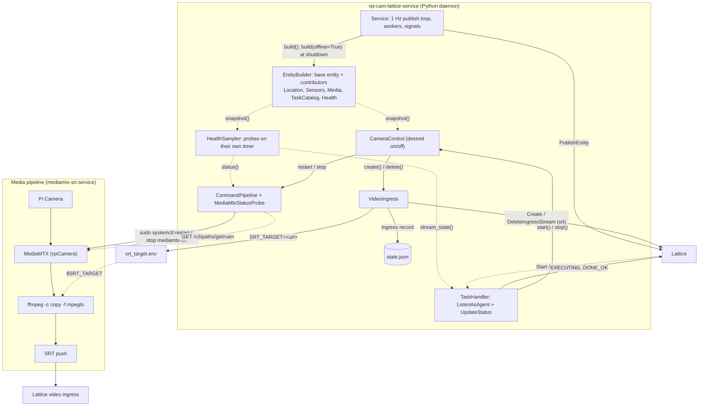

# rpi-cam-lattice-service

A Raspberry Pi camera published to **Lattice** with the Anduril Lattice SDK for
**gRPC (Connect)** in Python. The camera appears in Lattice as a stationary
**asset entity** with an EO camera sensor, a live **SRT video ingress**, real
**health telemetry**, and two custom tasks, **Start** and **Stop**, that an
operator can assign from the Lattice UI.

The repo is meant to be read as a guiding example of a small, honest Lattice
integration: the entity reports what is observed rather than what was
intended, every component is an independent contributor, and adding a feature
means adding one package and one wiring line. The health feature is the worked
example of that pattern (see [Adding a feature](#adding-a-feature-health-as-the-worked-example)).

Two `systemd` units run on the Pi:

1. **`rpi-cam-lattice-service`**, the Python daemon. It publishes the entity at
   1 Hz, registers the SRT ingress with Lattice's VideoManager and advertises
   the returned video id on `Media`, listens for tasks as a Lattice agent,
   samples the Pi's health, and owns the lifecycle of the second unit.
2. **`mediamtx-srt`**, a MediaMTX instance that captures the Pi Camera
   (`source: rpiCamera`) and pushes H.264 over **SRT (caller mode)** to the
   ingress URL Lattice returned. The daemon starts and stops it; it is never
   enabled at boot.

## How the pieces fit together



The daemon owns the Lattice video lifecycle and the media pipeline. On every
Start it registers a fresh ingress, writes the push URL to `srt_target.env`
(the `EnvironmentFile` of the MediaMTX unit), and restarts that unit so the
`runOnReady` ffmpeg command reads `$SRT_TARGET`. The ingress record is kept in
`state.json` so a crashed process is cleaned up at the next boot. The publish
loop never blocks on any of this: it reads snapshots and cached probe results,
builds the entity, and publishes. At shutdown the daemon stops the pipeline,
archives the ingress, and publishes one final entity marked offline so
operators see the asset go dark on purpose rather than expire.

## Repository layout

```
src/rpi_cam_lattice_service/
  main.py            wiring only: config, client, packages, boot recovery, run, shutdown
  config.py          strict .env + environment parsing with range validation
  state.py           StateStore: small JSON file (ingress record, created_time), atomic writes
  service.py         1 Hz publish loop, generic background workers, signals, offline publish
  logging_setup.py   structured JSON logging
  lattice/           Lattice API plumbing (imports nothing above it)
    transport.py     pyqwest HTTP/2 transport with TLS (Anduril CA support)
    auth.py          static token OR OAuth2 client credentials (static preferred)
    entities.py      EntityManager: publish_entity, get_entity
    video.py         VideoManager: create/delete (archive) SRT ingress, SrtIngressInfo
    tasks.py         TaskManager, agent side only: listen_as_agent, update_task_status
    client.py        LatticeClient: .entities / .video / .tasks / .auth, close()
  entity/            the composition seam
    base.py          base_entity(): identity floor (id, aliases, ontology, provenance, SIDC, expiry)
    contributors.py  BuildContext, EntityContributor, Location/Sensors/Media/TaskCatalog
    builder.py       EntityBuilder(config, entity_id, created_time, contributors).build()
  camera/
    source.py        CameraSource: fixed geodetic position
    pipeline.py      MediaPipeline protocol, PipelineStatus, CommandPipeline, MediaMtxStatusProbe
    control.py       CameraControl: desired state, Start/Stop ordering, recover(), shutdown()
    ingress.py       VideoIngress: one SRT ingress at a time, state.json record, srt_target.env
  tasking/
    definitions.py   Start/Stop names and type-URL helpers
    handler.py       TaskHandler: ListenAsAgent stream, dispatch, backoff, stream_state()
  health/            the worked example of adding a component
    report.py        Status, ComponentReport, AlertReport, ProbeResult, HealthSnapshot
    probes.py        Probe protocol; Thermal/Power/Pipeline/TaskStream/System probes
    sampler.py       HealthSampler: worker that runs probes on a timer, caches snapshot()
    contributor.py   HealthContributor: HealthSnapshot -> entity.health
task-def/            custom task definitions (Buf module for the Schema Registry)
  buf.yaml
  anduril/sample_app_rpi_cam/camera/v1alpha/camera_tasks.proto   Start {} and Stop {}
deploy/
  systemd/rpi-cam-lattice-service.service   the daemon (User=@SERVICE_USER@, rendered at install)
  systemd/mediamtx-srt.service              MediaMTX, no [Install] section on purpose
  sudoers.d/rpi-cam-lattice-service         lets the service user restart/stop MediaMTX
mediamtx.yml         MediaMTX config: rpiCamera -> ffmpeg -> SRT, control API on localhost
scripts/
  install.sh           create .venv, install the SDK pins, the package and dev tools
  install-mediamtx.sh  download the pinned MediaMTX binary (v1.16.1) on the Pi
  verify.py            read the published entity back from Lattice (separate process)
  send_task.py         create a Start/Stop task as an operator and watch it complete
tests/               one file per package above, plus the agent-only guard
Makefile             install, test, lint, typecheck, check, install-units
.github/workflows/ci.yml   ruff + mypy + pytest on Python 3.11 and 3.12
```

## Design principles

**Desired state versus observed state.** `CameraControl` records only what the
operator asked for (`desired_on`). What the entity reports comes from probes:
`MediaMtxStatusProbe` asks MediaMTX's control API whether the camera path is
`ready` and whether the SRT pusher is attached and moving bytes; health probes
read the SoC thermal zone and `vcgencmd`. A start command exiting 0 is never
taken as proof that video is flowing.

**One contributor per component.** `base_entity()` lays down the identity
floor (id, name, ontology, `mil_view`, provenance, `UNCLASSIFIED`
classification, a derived 2525C SIDC, a 10 s expiry). Every runtime component
is an `EntityContributor` with a single `apply(entity, ctx)` method, and
`EntityBuilder` runs them in order. Contributors depend on plain callables and
dataclasses, never on the control, pipeline, or client types; `main.py`
adapts the real sources. A new component is a new class and a new list entry,
not a new keyword argument threaded through a growing function.

**Never hold a lock across an RPC.** The entity expires 10 s after its last
publish and the loop runs at 1 Hz, so one heartbeat blocked behind a 30 s
VideoManager call or `systemctl` timeout would take the camera off the map.
`CameraControl` has a transition lock that serialises the transitions and a
separate state lock that is never held while calling the pipeline, the
ingress, or the publish callback. `VideoIngress`,
`TaskHandler.stream_state()` and the OAuth token cache in `lattice/auth.py`
follow the same rule. The MediaMTX probe is
cached (2 s TTL, 0.5 s timeout) and health probes run on their own worker
thread, never on the publish tick.

**The daemon owns the media pipeline and persists what it must clean up.**
Every Start creates a new Lattice ingress and every Stop archives it, so
MediaMTX is restarted with the new URL in an order that never leaves it
pushing at a dead stream or the entity advertising one. The ingress record and
`created_time` live in `state.json` (atomic writes): at boot `recover()`
archives an ingress a crashed predecessor left behind; at exit `shutdown()`
stops the pipeline and archives, then `main.py` publishes the entity offline.
The MediaMTX unit has no `[Install]` section for the same reason.

**Strict config that fails loudly.** A value that is present but malformed
(`CAMERA_LATITUDE=abc`) raises `ConfigError` naming the key, and coordinates
and intervals are range-checked. Silently placing the camera on the demo site
after a typo is worse than refusing to start.

**Agent only.** The daemon listens for tasks and reports status; it never
creates tasks. Operator-side creation lives in `scripts/send_task.py` only,
and `tests/test_agent_only.py` fails if `create_task(` or `CreateTaskRequest`
ever appears in the installed package.

**Read-back verification from a separate process.** Done is not "publish
returned" but "another client can read the entity back": `scripts/verify.py`
builds its own `LatticeClient`, calls `GetEntity`, and prints what Lattice holds.

## Adding a feature: health as the worked example

Health telemetry follows the path every new component should take. Nothing in
the publish loop, the other packages, or the entity builder changes.

1. **Report types** (`health/report.py`). Plain Python, no protobuf:
   `ComponentReport(id, name, status, messages, sampled_at)`,
   `AlertReport(code, description, level, conditions, activated_at)`,
   `ProbeResult` (what one probe learned in one round) and
   `HealthSnapshot(components, alerts, sampled_at)` with an `overall` roll-up
   (worst component) and `is_degraded`. Keeping the domain model free of SDK
   types keeps the probes and their tests free of it too; the translation to
   wire types happens in exactly one file.
2. **Probes** (`health/probes.py`). A `Probe` has one method,
   `sample(now) -> ProbeResult`, and never raises. Each probe takes its inputs
   as constructor arguments so tests feed it fixtures rather than the real Pi:
   `ThermalProbe(throttled, temp_path, warn_c, fail_c)`, `PowerProbe(throttled)`,
   `PipelineProbe(status, desired_on)` (reports `camera` and `stream`),
   `TaskStreamProbe(stream_state, heartbeat_interval_ms)`, `SystemProbe(loadavg_path,
   meminfo_path, disk_path)`. `ThrottledFlagsReader` wraps `vcgencmd get_throttled`
   with an injectable command runner.
3. **Sampler worker** (`health/sampler.py`). `HealthSampler(probes,
   interval_s=...)` has a `run(stop)` method, exactly the `Worker` signature
   `Service` runs on a daemon thread. It samples every
   `HEALTH_SAMPLE_INTERVAL_SECONDS`, caches the result, and exposes
   `snapshot()`, which never blocks (`None` before the first round;
   `sample_once()` takes one synchronously at boot).
4. **Contributor** (`health/contributor.py`). `HealthContributor(snapshot)`
   maps a `HealthSnapshot` to the SDK `Health` message: one `ComponentHealth`
   per report, `active_alerts` from the alert reports, `health_status` from
   `overall`, and `connection_status` `OFFLINE` when `ctx.offline` (the final
   shutdown publish).
5. **Wiring** (`main.py`). One contributor entry and one worker entry:

   ```python
   sampler = HealthSampler(probes, interval_s=config.health_sample_interval_seconds)
   contributors.append(HealthContributor(sampler.snapshot))
   workers.append(("health", sampler.run))
   ```

6. **Verify.** `scripts/verify.py` prints the health status, the connection
   status, each component with its status and messages, and any active alerts.
7. **Tests** (`tests/test_health.py`). Probes are tested against fixture
   files and fake `get_throttled` output; the contributor is tested by
   building an entity and inspecting `entity.health`.

The components and how observations map to Lattice `HealthStatus` values:

| Component id | Source (verified on this Pi) | Mapping |
|---|---|---|
| `soc-thermal` | `/sys/class/thermal/thermal_zone0/temp`; `vcgencmd get_throttled` bit 3 | at or above `HEALTH_TEMP_WARN_C` or soft limit active: `WARN`; throttled now (bit 2) or at or above `HEALTH_TEMP_FAIL_C`: `FAIL`; alert `THERMAL_THROTTLE` (`WARNING`) |
| `power` | `vcgencmd get_throttled` bits 0, 16, 17, 18 | under-voltage now: `FAIL`; under-voltage, frequency capping or throttling occurred since boot: `WARN`; alert `UNDER_VOLTAGE` (`CAUTION`) |
| `camera` | `PipelineStatus.ready` | desired on and `False`: `FAIL`; `None` (probe unavailable): `NOT_READY` |
| `stream` | `PipelineStatus.pushing` | desired on and `False`: `FAIL`; desired off: `NOT_READY` "stopped by operator" |
| `tasking` | `TaskHandler.stream_state()` | heartbeat older than twice the interval: `WARN`; disconnected: `OFFLINE` |
| `system` | `/proc/loadavg`, `/proc/meminfo`, `shutil.disk_usage` | thresholds: `WARN` |

The one cross-package touch is `CameraObservation`, which gains a `degraded`
flag so the sensor reports `DEGRADED` when the stream is up but the SoC is
throttled or under-powered. Everything else is additive.

## SDK packages

Two Buf Schema Registry packages, pinned in `requirements.txt` and
`pyproject.toml`: the protobuf messages (`anduril-lattice-sdk-bufbuild-py`)
and the Connect stubs (`anduril-lattice-sdk-connectrpc-py`), on Anduril's
pure-Python `protobuf` runtime and `connectrpc`/`pyqwest`. Notable: enums use
short member names (`Template.ASSET`, `SensorType.CAMERA`); some numeric
fields are `DoubleValue` wrappers; oneofs are set with
`protobuf.Oneof(field, value)`. Auth is manual on gRPC/Connect: the bearer
token (and `SANDBOXES_TOKEN` for a Sandbox) is attached as request metadata.

## Setup

```bash
make install                      # or ./scripts/install.sh: creates .venv, installs pins + dev tools
cp .env.example .env              # then fill in real values
./scripts/install-mediamtx.sh     # ON THE PI: fetch the MediaMTX arm64 binary
```

## Configuration

Config is read from `.env` (path via `--config`); real environment variables
take precedence, so systemd `Environment=` / `EnvironmentFile=` also work.
Config is read once at startup; changing it requires a restart.

**Auth and TLS**

| Variable | Meaning |
|---|---|
| `LATTICE_ENDPOINT` | Environment hostname, no scheme. Required. |
| `ENVIRONMENT_TOKEN` | Static bearer token (preferred when set). |
| `CLIENT_ID` / `CLIENT_SECRET` | OAuth2 client credentials (used when no static token). |
| `SANDBOXES_TOKEN` | Sandbox authorization token; additive, sent on every call. |
| `LATTICE_CA_CERT_PATH` | Anduril-issued PEM CA for offline environments. Verification stays on; the OS trust store is still included. |

**Camera entity**

| Variable | Meaning |
|---|---|
| `ENTITY_ID` / `ENTITY_NAME` | Stable id and display name (default `rpi-cam-01` / `RPi Camera`). |
| `PLATFORM_TYPE` | Ontology platform type (default `Camera`). |
| `INTEGRATION_NAME` | Provenance integration name (default `rpi-cam-lattice-service`). |
| `CAMERA_LATITUDE` / `CAMERA_LONGITUDE` / `CAMERA_ALTITUDE_HAE_METERS` | The camera's fixed location. Set these; the defaults are demo coordinates. Range-checked. |
| `STATE_FILE` | JSON file for the ingress record and `created_time` (default `./state.json`). Must be writable by the service user. |

**Video**

| Variable | Meaning |
|---|---|
| `VIDEO_ENABLED` | Register an SRT ingress and advertise the video id (default `true`). |
| `VIDEO_TITLE` | Ingress title (default `<ENTITY_NAME> (SRT)`). |
| `SRT_PASSPHRASE` | Optional SRT ingress passphrase. |
| `SRT_TARGET_FILE` | Where to write `SRT_TARGET=<url>` for the MediaMTX unit (default `./srt_target.env`). |
| `MEDIAMTX_API_URL` | MediaMTX control API used by the status probe (default `http://127.0.0.1:9997`). Keep in sync with `apiAddress` in `mediamtx.yml`. |
| `MEDIAMTX_PATH` | MediaMTX path the camera publishes to (default `cam`). |

**Tasking**

| Variable | Meaning |
|---|---|
| `TASKING_ENABLED` | Advertise the task catalog and listen for tasks (default `true`). |
| `TASK_PACKAGE` | Protobuf package of the task definitions (default `anduril.sample_app_rpi_cam.camera.v1alpha`); must match `task-def/`. |
| `TASK_START_COMMAND` / `TASK_STOP_COMMAND` | Shell commands that bring the stream up and down. On the Pi: `sudo systemctl restart mediamtx-srt` and `sudo systemctl stop mediamtx-srt`. Empty = state-only transitions (development off the Pi). |
| `TASK_HEARTBEAT_INTERVAL_MS` | Heartbeat interval requested on the agent stream (default `30000`; must be at least `1000` while tasking is enabled, because the health `tasking` component relies on heartbeats). |

`sudo` matches the full command line, so `TASK_START_COMMAND` and
`TASK_STOP_COMMAND` must be byte-identical to the commands in
`deploy/sudoers.d/rpi-cam-lattice-service`: no extra flags, spaces, or a
different unit name.

**Health**

| Variable | Meaning |
|---|---|
| `HEALTH_ENABLED` | Sample the Pi's health and publish the `Health` component from it (default `true`). |
| `HEALTH_SAMPLE_INTERVAL_SECONDS` | How often the sampler worker runs the probes (default `5.0`). |
| `HEALTH_TEMP_WARN_C` | SoC temperature at which `soc-thermal` reports `WARN` (default `75.0`; must be below the fail threshold). |
| `HEALTH_TEMP_FAIL_C` | SoC temperature at which `soc-thermal` reports `FAIL` (default `85.0`). |

See `.env.example` for the defaults and the comments on every key.

## Run

On the Pi, use the systemd units (see [Deploy](#deploy-systemd-on-the-pi)).
For a manual run:

```bash
rpi-cam-lattice-service --config .env [--debug]   # or: python -m rpi_cam_lattice_service
```

## Verify (live round-trip)

The entity, video, and task loop has been verified live against a Lattice
sandbox: the entity reads back `is_live: True` with a `Media` item, MediaMTX
pushes to the returned ingress, and Stop/Start tasks reach `DONE_OK` with the
sensor going `OFF` and back to `OPERATIONAL`. The health output is what to
check after deploying this version.

```bash
rpi-cam-lattice-service --config .env                        # terminal 1 (or the systemd unit)
python scripts/verify.py --config .env                       # terminal 2; --entity-id overrides ENTITY_ID
```

Expect `is_live: True`, a video id under `Media`, the sensor state, the two
task catalog URLs, and the health block: overall status and connection, one
line per component (`soc-thermal`, `power`, `camera`, `stream`, `tasking`,
`system`) with its messages, and any active alerts (`THERMAL_THROTTLE`,
`UNDER_VOLTAGE`).

To prove the task loop, dispatch a task from a separate process and watch it
reach a terminal state:

```bash
python scripts/send_task.py --config .env Stop    # expect SENT -> EXECUTING -> DONE_OK
python scripts/verify.py --config .env            # sensor state: OFF, no video id, stream: NOT_READY
python scripts/send_task.py --config .env Start   # sensor state back to OPERATIONAL, new video id
```

`send_task.py` accepts `--entity-id` and `--wait <seconds>` (default 20).

## Tasking

The camera is a **taskable agent**. Two custom task definitions live in
`task-def/` as empty Protobuf messages, identified purely by name:

| Task | Type URL | Effect |
|---|---|---|
| `Start` | `type.googleapis.com/anduril.sample_app_rpi_cam.camera.v1alpha.Start` | `CreateIngressStream` (new id), write `SRT_TARGET`, run `TASK_START_COMMAND`; sensor `OPERATIONAL`, `Media` advertises the new video id |
| `Stop`  | `type.googleapis.com/anduril.sample_app_rpi_cam.camera.v1alpha.Stop`  | run `TASK_STOP_COMMAND`, then `DeleteIngressStream`; sensor `OFF`, `Media` cleared |

Push the definitions to the Lattice Schema Registry once (details in
`task-def/README.md`):

```bash
export BUF_TOKEN=<token>@schema-registry.developer.anduril.com
cd task-def && buf lint && buf build && buf push
```

Every `Stop` cleans up the Lattice side and every `Start` rebuilds it, in an
order that never leaves MediaMTX pushing at a dead stream or the entity
advertising one:

1. **Start**: `CreateIngressStream` under a new client id (Lattice returns a
   server-shaped `<client id>#<suffix>`, which is what gets advertised and
   archived), persist the record in `state.json`, write the SRT push URL to
   `SRT_TARGET_FILE`, then run `TASK_START_COMMAND` (`systemctl restart`, so
   MediaMTX re-reads the file). If the command fails the ingress is archived.
2. **Stop**: run `TASK_STOP_COMMAND` first, then `DeleteIngressStream`. Lattice
   *archives* the record rather than deleting it (it stays retrievable under
   its id), which is why the next Start must not reuse the id. If archiving
   fails the task ends `DONE_NOT_OK`, the sensor already reads `OFF`, and the
   id is kept so a repeated Stop retries it. The next `Start` archives that
   leftover first (it may already be dead server-side) and only then
   registers a fresh ingress; a `Start` repeated while the stream is already
   on reuses the live ingress.
3. **Entity updates**: each transition ends by publishing the asset at once
   (`Service.publish_now`). After `Start` the `Media` items carry the new id;
   after `Stop` they are an explicitly empty list, which clears the archived
   item. The task only reports `DONE_OK` once that publish succeeds.

The agent stream reconnects with exponential backoff and jitter (1 s doubling
to a 30 s cap). Every status update carries a strictly increasing
`status_version`: the counter starts from the delivered version, adopts the
version Lattice returns after each update, and is re-read with `GetTask` when
a cancel or complete request arrives, since those bump the version server-side
but carry only the task id. Start and Stop are not interruptible, so a cancel
that lands mid-action is honoured afterwards: the task ends `DONE_NOT_OK` with
`CANCELLED` even though the action completed. A complete request marks the
task terminal locally and nothing more is sent. Once shutdown has begun, any
queued Start or Stop fails with `DONE_NOT_OK` instead of undoing the cleanup.

## Test and lint

```bash
make check        # ruff check, ruff format --check, mypy, pytest
make test         # pytest only
```

Tests use fakes for the Lattice client, the MediaMTX API, and the probes;
nothing talks to Lattice, the camera, or `vcgencmd`. The pipeline tests run
harmless shell commands (`true`, `exit 7`, `cp`) to exercise the real
`subprocess` path. CI (`.github/workflows/ci.yml`) runs the
same steps on Python 3.11 and 3.12.

## Deploy (systemd on the Pi)

The files under `deploy/` are templates with two placeholders: `@INSTALL_DIR@`
(the checkout path) and `@SERVICE_USER@` (the unprivileged account that runs
the daemon and owns the checkout). `make install-units` renders them into
`build/deploy/` and installs the result. The defaults are the current directory
and the invoking user; override either on the command line:

```bash
make install-units                                    # renders, visudo -c, installs both units + the sudoers rule, daemon-reload
make install-units SERVICE_USER=rpi-cam INSTALL_DIR=/opt/rpi-cam-lattice-service   # explicit values
sudo systemctl enable --now rpi-cam-lattice-service   # recovers state, creates the ingress, starts MediaMTX
journalctl -u rpi-cam-lattice-service -u mediamtx-srt -f
```

The daemon runs unprivileged. Start and Stop tasks need to restart and stop
MediaMTX, so the sudoers drop-in lets the service account run exactly those
two commands without a password:

```
@SERVICE_USER@ ALL=(root) NOPASSWD: /usr/bin/systemctl restart mediamtx-srt, /usr/bin/systemctl stop mediamtx-srt
```

Set `TASK_START_COMMAND=sudo systemctl restart mediamtx-srt` and
`TASK_STOP_COMMAND=sudo systemctl stop mediamtx-srt` in `.env` to match. The
daemon unit deliberately does not set `NoNewPrivileges=yes` (it would forbid
the setuid transition `sudo` relies on).

**Never enable `mediamtx-srt`.** The unit has no `[Install]` section, so
`systemctl enable` fails on purpose. Only the daemon knows when a valid
`srt_target.env` exists (after a Start); an earlier version enabled at boot
failed repeatedly because `After=` orders on the daemon process starting, not
on the file being written. `ConditionPathExists=` and `EnvironmentFile=-` on
that file make a premature start a skip rather than a `Restart=` loop.

### Upgrading a running Pi

Applying this version over an older install that ran as root and enabled the
MediaMTX unit:

```bash
sudo chown "$USER:$USER" srt_target.env     # or delete it; an earlier root run left it root-owned
sudo systemctl disable --now mediamtx-srt     # the daemon starts it from now on
make install                                  # rebuild .venv with the pinned SDK
make install-units                            # new units + sudoers rule, daemon-reload
sudo systemctl restart rpi-cam-lattice-service
python scripts/verify.py --config .env        # check the health block
```
