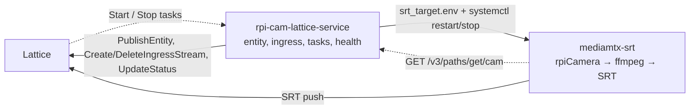

# rpi-cam-lattice-service

A Raspberry Pi camera published to Lattice with the Python gRPC (Connect) SDK.
The camera appears as a stationary asset with an EO sensor, a live SRT video
ingress, per-component health, and two custom tasks, `Start` and `Stop`.

Two systemd units run on the Pi. The Python daemon publishes the entity at
1 Hz, registers the SRT ingress, listens for tasks as a Lattice agent, samples
health, and starts and stops the second unit: MediaMTX, which captures the Pi
Camera and pushes H.264 over SRT to the ingress URL Lattice returned.



## Layout

```
src/lattice_cam/
  main.py        wiring only
  config.py      strict .env parsing
  state.py       JSON state: ingress record, created_time
  runtime.py     1 Hz publish loop, workers, offline publish at shutdown
  lattice/       transport, auth, one thin client per API (.entities .video .tasks)
  entity/        base entity + one contributor per component (the extension seam)
  camera/        pipeline (MediaMTX commands + status probe), Start/Stop control, ingress
  tasking/       ListenAsAgent stream, dispatch, status lifecycle
  health/        probes -> sampler worker -> snapshot -> Health contributor
task-def/        Start/Stop protobuf definitions (Buf module for the Schema Registry)
deploy/          systemd unit templates and the sudoers drop-in
scripts/         install.sh, install-mediamtx.sh, verify.py, send_task.py
tests/           one file per package; fakes only, nothing talks to Lattice
```

## Setup

```bash
make install                   # creates .venv with the pinned SDK and dev tools
cp .env.example .env           # every key is documented there; set the camera position
./scripts/install-mediamtx.sh  # on the Pi: fetch the MediaMTX binary
```

Config comes from `.env` (or real environment variables, which win) and is
validated strictly: a malformed value fails at startup rather than falling back
to a default. `TASK_START_COMMAND` and `TASK_STOP_COMMAND` must match the
sudoers rule byte for byte.

## Run and verify

```bash
.venv/bin/rpi-cam-lattice-service --config .env          # or the systemd unit
.venv/bin/python scripts/verify.py --config .env         # read the entity back: media, sensor, catalog, health
.venv/bin/python scripts/send_task.py --config .env Stop  # SENT -> EXECUTING -> DONE_OK; then Start
make check                                                # ruff, mypy, pytest
```

Push the task definitions once: `export BUF_TOKEN=<token>@schema-registry.developer.anduril.com`,
then `cd task-def && buf lint && buf build && buf push`.

## Deploy

The files under `deploy/` are templates. `make install-units` renders
`@INSTALL_DIR@` and `@SERVICE_USER@` (defaults: this checkout and the invoking
user), validates the sudoers rule, installs both units, and reloads systemd.

```bash
make install-units [SERVICE_USER=rpi-cam INSTALL_DIR=/opt/rpi-cam-lattice-service]
sudo systemctl enable --now rpi-cam-lattice-service
journalctl -u rpi-cam-lattice-service -u mediamtx-srt -f
```

The daemon runs unprivileged and may run exactly two commands through sudo:
`systemctl restart mediamtx-srt` and `systemctl stop mediamtx-srt`. Never
enable `mediamtx-srt`; it has no `[Install]` section on purpose, because only
the daemon knows when a valid `srt_target.env` exists.

## Upgrade

On a Pi that already runs the integration, pull the new version and:

```bash
make install                                       # rebuild .venv against the pinned SDK
make install-units                                 # re-render and install units + sudoers rule
sudo systemctl restart rpi-cam-lattice-service     # stops MediaMTX, archives the ingress, starts fresh
.venv/bin/python scripts/verify.py --config .env   # confirm the entity reads back as expected
```

The daemon persists its ingress record in `state.json`, so an ingress left by
the old process is archived at startup. Check `.env.example` after an upgrade
for new keys; they all have defaults, so an old `.env` keeps working.

If the previous install ran the daemon as root or had `mediamtx-srt` enabled,
run these first:

```bash
sudo chown "$USER:$USER" srt_target.env      # root-owned file from the old run
sudo systemctl disable --now mediamtx-srt    # the daemon starts it from now on
```

## Add a new component

Health is the worked example. Each step lives in `health/`:

1. Plain-Python report types, no protobuf (`report.py`).
2. Probes with a single `sample(now)` that never raises and takes its inputs
   as constructor arguments, so tests use fixtures (`probes.py`).
3. A sampler with a `run(stop)` method, which `Service` runs on its own thread,
   caching a `snapshot()` that never blocks (`sampler.py`).
4. A contributor that maps the snapshot onto the SDK message (`contributor.py`).
5. Two lines in `main.py`:

```python
contributors.append(HealthContributor(sampler.snapshot))
workers.append(("health", sampler.run))
```