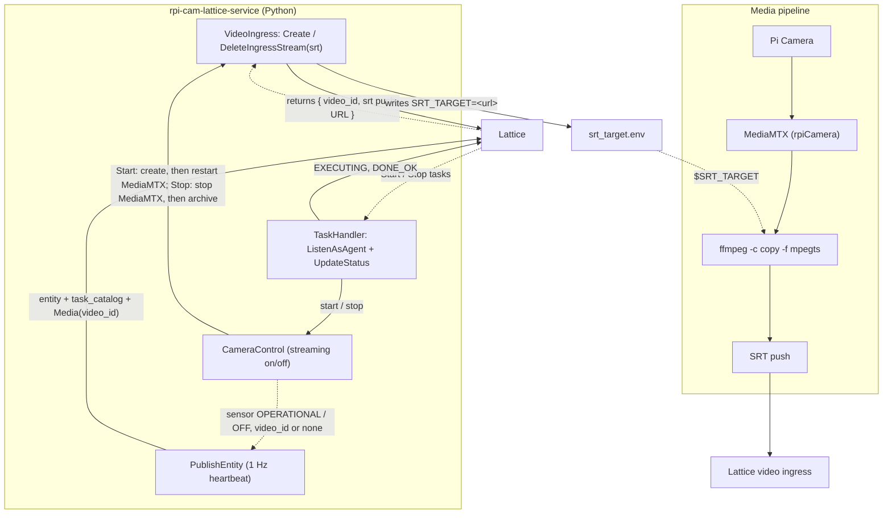

# rpi-cam-lattice-service

A Raspberry Pi camera **Lattice integration** built on the Anduril Lattice SDK
for **gRPC (Connect)** in Python, packaged to run as a `systemd` service
alongside a **MediaMTX SRT push** server on the same Pi.

The app demonstrates two `systemd` services that cooperate:

1. **`rpi-cam-lattice-service`** — publishes the camera to
   Lattice as a stationary **asset entity** with an EO camera sensor and health,
   and registers an **SRT video ingress** with Lattice's VideoManager. The video
   id Lattice returns is advertised on the entity's `Media` component so
   operators can find the live feed. The entity is also a **taskable agent**:
   it advertises custom `Start` / `Stop` tasks in its `task_catalog` and
   executes them when an operator assigns one (see [Tasking](#tasking)).
2. **MediaMTX** (SRT push) — captures the Pi Camera (`source: rpiCamera`) and
   pushes the H.264 stream over **SRT (caller mode)** to the ingress URL Lattice
   returned. This mirrors the sibling `rtsp-server` / `mpeg-ts-server` projects,
   but the egress transport is SRT.

## How the pieces fit together



The Python service owns the Lattice video lifecycle. It passes MediaMTX the SRT
destination through the `srt_target.env` `EnvironmentFile`, which the MediaMTX
systemd unit loads so the `runOnReady` ffmpeg command can read it as
`$SRT_TARGET`.

## Repository layout

```
src/rpi_cam_lattice_service/
  main.py            entry point: config, client, wiring, boot-time Start, run
  config.py          .env + env-var config (auth, TLS, camera, video, tasking)
  logging_setup.py   structured JSON logging
  service.py         lifecycle: 1 Hz publish loop, task thread, signals, shutdown
  lattice/           Lattice API plumbing (imports nothing above it)
    transport.py     pyqwest HTTP/2 client with TLS (Anduril CA support)
    auth.py          static token OR OAuth2 client-credentials (static preferred)
    entities.py      EntityManager: publish_entity, get_entity
    video.py         VideoManager: create/delete (archive) SRT ingress, SrtIngressInfo
    tasks.py         TaskManager, agent side only: listen_as_agent, update_task_status
    client.py        LatticeClient facade over the three clients
  camera/            the camera path
    source.py        CameraState (fixed geodetic position) + CameraSource
    entity.py        CameraState + control state -> Entity (sensor, Media, task_catalog)
    control.py       CameraControl: Start/Stop sequencing, MediaMTX commands, publish hook
    ingress.py       VideoIngress: one SRT ingress at a time, writes srt_target.env
  tasking/           Lattice tasking, agent side
    definitions.py   Start/Stop names and type-URL helpers
    handler.py       TaskHandler: ListenAsAgent stream, dispatch, status lifecycle
task-def/            custom task definitions (Buf module for the Schema Registry)
  buf.yaml
  anduril.sample_app_rpi_cam.camera.v1alpha/camera_tasks.proto   Start {} and Stop {}
mediamtx.yml         MediaMTX SRT push config (rpiCamera -> ffmpeg -> SRT)
deploy/systemd/
  rpi-cam-lattice-service.service   the Python daemon
  mediamtx-srt.service              the MediaMTX SRT push server
scripts/
  install-mediamtx.sh  download pinned MediaMTX (v1.16.1) arm64 on the Pi
  verify.py            read the published entity back from Lattice
  send_task.py         dispatch a Start/Stop task and watch it complete
tests/                 camera + entity mapping, control/ingress lifecycle, tasking, agent-only guard
```

## SDK packages

Two Buf Schema Registry packages: the protobuf
messages (`anduril-lattice-sdk-bufbuild-py`) and the Connect stubs
(`anduril-lattice-sdk-connectrpc-py`). They use Anduril's pure-Python `protobuf`
runtime and the `connectrpc`/`pyqwest` runtime. Notable: enums use short member
names (`Template.ASSET`, `SensorType.CAMERA`, `MediaType.VIDEO`); some numeric
fields are `DoubleValue` wrappers; oneofs are set with `protobuf.Oneof(field, value)`.

## Setup

```bash
python3 -m venv .venv
source .venv/bin/activate
pip install -r requirements.txt   # carries the --extra-index-url
pip install -e ".[dev]"           # editable install + pytest
cp .env.example .env              # then fill in real values
./scripts/install-mediamtx.sh     # ON THE PI: fetch the MediaMTX arm64 binary
```

## Configuration

Config is read from `.env` (path via `--config`); real environment variables
take precedence (so systemd `Environment=`/`EnvironmentFile=` works).

**Auth & TLS**:

| Variable | Meaning |
|---|---|
| `LATTICE_ENDPOINT` | Environment hostname, no scheme. |
| `ENVIRONMENT_TOKEN` | Static bearer token (preferred when set). |
| `CLIENT_ID` / `CLIENT_SECRET` | OAuth2 client credentials (used when no static token). |
| `SANDBOXES_TOKEN` | Sandbox authorization token; additive. |
| `LATTICE_CA_CERT_PATH` | Anduril-issued PEM CA for offline/air-gapped TLS (recommended edge method; verification stays on). |

**Camera & video:**

| Variable | Meaning |
|---|---|
| `ENTITY_ID` / `ENTITY_NAME` | Stable id/display name for the camera entity. |
| `PLATFORM_TYPE` | Ontology platform type (default `Camera`). |
| `CAMERA_LATITUDE` / `CAMERA_LONGITUDE` / `CAMERA_ALTITUDE_HAE_METERS` | The camera's fixed location — **set these**. |
| `VIDEO_ENABLED` | Register an SRT ingress with Lattice and advertise the video id (default `true`). |
| `VIDEO_TITLE` | Ingress stream title (defaults to the entity name). |
| `SRT_PASSPHRASE` | Optional SRT ingress passphrase. |
| `SRT_TARGET_FILE` | Where to write `SRT_TARGET=<url>` for the MediaMTX unit (default `./srt_target.env`). |

**Tasking:**

| Variable | Meaning |
|---|---|
| `TASKING_ENABLED` | Advertise the task catalog and listen for tasks (default `true`). |
| `TASK_PACKAGE` | Protobuf package of the task definitions (default `anduril.sample_app_rpi_cam.camera.v1alpha`); must match `task-def/`. |
| `TASK_START_COMMAND` / `TASK_STOP_COMMAND` | Shell commands that bring the stream up/down (e.g. `sudo systemctl restart mediamtx-srt` / `... stop mediamtx-srt`). Empty = state-only. |
| `TASK_HEARTBEAT_INTERVAL_MS` | Heartbeat interval requested on the agent stream (default `30000`). |

## Run

On the Pi, run both services (see systemd below), or manually for testing:

```bash
# 1) Lattice service: publishes the entity + registers the SRT ingress,
#    writing srt_target.env for MediaMTX.
rpi-cam-lattice-service --config .env   # or: python -m rpi_cam_lattice_service

# 2) MediaMTX: reads srt_target.env and pushes the camera over SRT.
set -a; . ./srt_target.env; set +a
./mediamtx mediamtx.yml
```

Off-Pi, you can exercise the SRT path from a Mac with `scripts/push-mac-cam.sh`
(set `SRT_TARGET` to the URL the service logged).

## Verify (live round-trip)

Live verification is deferred (no reachable environment during development). On a
network where `LATTICE_ENDPOINT` is reachable:

```bash
rpi-cam-lattice-service --config .env          # terminal 1
python scripts/verify.py --config .env --entity-id rpi-cam-01   # terminal 2
```

Expect `is_live: True`. Confirm the entity carries a `Media` item (the video id)
and that MediaMTX's SRT push reaches the Lattice ingress. The output also lists
the advertised task catalog and the sensor's operational state.

To prove the task loop, dispatch a task from a separate process and watch it
reach a terminal state:

```bash
python scripts/send_task.py --config .env Stop    # expect SENT -> EXECUTING -> DONE_OK
python scripts/verify.py --config .env            # sensor state: OFF
python scripts/send_task.py --config .env Start   # sensor state back to OPERATIONAL
```

## Tasking

The camera is a **taskable agent**. Two custom task definitions live in
`task-def/` as empty Protobuf messages, identified purely by name:

| Task | Type URL | Effect |
|---|---|---|
| `Start` | `type.googleapis.com/anduril.sample_app_rpi_cam.camera.v1alpha.Start` | `CreateIngressStream` (new id), write `SRT_TARGET`, run `TASK_START_COMMAND`; sensor `OPERATIONAL`, `Media` advertises the new video id |
| `Stop`  | `type.googleapis.com/anduril.sample_app_rpi_cam.camera.v1alpha.Stop`  | run `TASK_STOP_COMMAND`, then `DeleteIngressStream`; sensor `OFF`, `Media` cleared |

**Publish the definitions** to the Lattice Schema Registry once (an operator
can only assign a task whose type Lattice knows; publishing registers it for
Sandboxes automatically). See `task-def/README.md`:

```bash
export BUF_TOKEN="$(cat ~/workspace/secrets/afard-token-rpi.txt)@schema-registry.developer.anduril.com"
cd task-def && buf lint && buf build && buf push
```

**Ingress lifecycle (`camera/ingress.py`, `camera/control.py`).** Every Stop cleans up the
Lattice side and every Start rebuilds it, in an order that never leaves
MediaMTX pushing at a dead stream or the entity advertising one:

1. **Start**: `CreateIngressStream` under a *fresh* id (a UUID; Lattice allows 4-36 characters),
   write the returned SRT push URL to `SRT_TARGET_FILE`, then run
   `TASK_START_COMMAND` (use `systemctl restart`, not `start`, so MediaMTX
   re-reads the file). If the command fails the new ingress is archived again.
2. **Stop**: run `TASK_STOP_COMMAND` first, then `DeleteIngressStream`. Lattice
   *archives* the record rather than deleting it (it stays retrievable under
   its id), which is why the next Start must not reuse the id. If archiving
   fails the task ends `DONE_NOT_OK`, the sensor already reads `OFF`, and the
   id is kept so a repeated Stop retries it.
3. **Entity update, as part of the task.** Each transition ends by publishing
   the asset immediately (`Service.publish_now`): after Start the `Media`
   items carry the new ingress id; after Stop they are published as an
   explicitly empty list, which clears the archived item. The task only
   reports `DONE_OK` once that publish succeeds; the 1 Hz loop then keeps the
   same state. (The docs' `OverrideEntity` route is for tools that are *not*
   the publisher: an override would mask this service's own later publishes.)
4. **Boot** runs Start best-effort; on failure the entity is published with the
   sensor `OFF` and no video, and an operator's Start is the retry. **Exit**
   (SIGTERM) runs the stop command and archives the ingress, so a service
   restart yields a new ingress and a MediaMTX restart rather than an orphan.

## Test

```bash
pytest   # camera + entity mapping, control/ingress lifecycle, task handler, agent-only guard
```

## Deploy (systemd on the Pi)

```bash
sudo cp deploy/systemd/rpi-cam-lattice-service.service /etc/systemd/system/
sudo cp deploy/systemd/mediamtx-srt.service /etc/systemd/system/
sudo systemctl daemon-reload
sudo systemctl enable --now rpi-cam-lattice-service   # creates the ingress, writes srt_target.env
sudo systemctl enable --now mediamtx-srt              # loads it, pushes SRT
journalctl -u rpi-cam-lattice-service -u mediamtx-srt -f
```

Edit the `WorkingDirectory`/`ExecStart`/`EnvironmentFile` paths in both units for
your install location. So that Start/Stop tasks can restart and stop MediaMTX
(a new ingress URL on every Start), let the service user run exactly those two
commands without a password, then set the task commands in `.env`:

## Note

- If `VIDEO_ENABLED=false` or the boot-time Start fails, for example if the endpoint
  is unreachable at startup, the service still publishes the camera entity —
  sensor `OFF`, no video reference — and logs a warning. A Start task retries.
- Auth errors over gRPC against a Sandbox, and what they mean:
  - `missing authorization header, bearer-token cookie or anduril-sandbox-authorization`
    — the Sandbox gateway did not get `SANDBOXES_TOKEN`.
  - `request could not be authenticated` — `SANDBOXES_TOKEN` is not a valid Sandboxes token.
  - `error verifying token: ... error in cryptographic primitive` — the gateway accepted the
    Sandboxes token but `ENVIRONMENT_TOKEN` was not issued for this environment
    (regenerate it for the environment named in `LATTICE_ENDPOINT`).
- Tasks can only be assigned once the `task-def/` schemas are pushed to the Schema
  Registry, and only to an entity whose catalog advertises the task's type URL.
